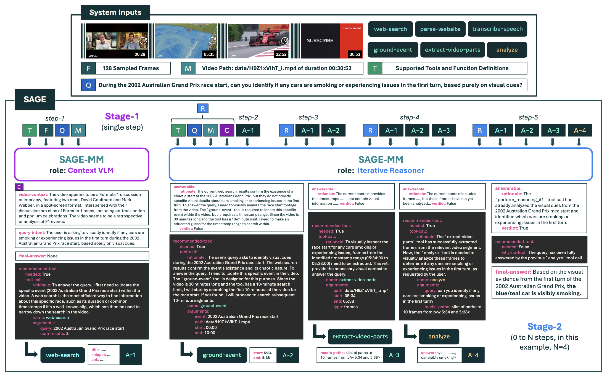

# SAGE

[[`Project Page`](https://praeclarumjj3.github.io/sage/)] | [[`arXiv`](https://arxiv.org/abs/2512.13874)] [[`Artifacts`](https://huggingface.co/collections/allenai/sage)] [[`SAGE-Bench`](https://huggingface.co/datasets/allenai/SAGE-Bench)]  [[`BibTeX`](#citation)]

This repo contains the code for our paper **SAGE: Training Smart Any-Horizon Agents for Long Video Reasoning with Reinforcement Learning**.

<p align="center">
    
</p>

## News

- **[December 16, 2025]**: 🚀 [**SAGE**](https://praeclarumjj3.github.io/sage/) is publicly released. We also open-source all the [artifacts](https://huggingface.co/collections/allenai/sage) including model checkpoints, datasets and benchmark on huggingface hub! 🎁

## Installation Instructions

- Clone this repository.

    ```bash
    git lfs install
    git clone https://github.com/allenai/SAGE
    cd SAGE
    ```

- Setup conda environment with the base dependencies.

    ```bash
    conda create --name sage -y python=3.11 && conda activate sage
    sudo apt-get update && sudo apt-get install -y ffmpeg # reqd for extracting video parts and transcript audio 
    pip install decord qwen_vl_utils
    pip install torch==2.8.0 torchvision==0.23.0 torchaudio==2.8.0 --index-url https://download.pytorch.org/whl/cu126
    pip install -e . && pip install -e verl/
    pip install transformers==4.57.0
    pip install vllm==0.11.0
    pip install flash-attn==2.7.3
    pip install trl deepspeed # only for SFT
    ```

- You need to setup three services to use SAGE:

    - Obtain a [Serper API key](https://serper.dev/) (there are some free credits available) for the `web-search` tool.
    - vLLM server for the `ground-event` and `analyze` tools.
       
        ```bash
        bash scripts/start_vllm_qwen3vl.sh # requires 2x80G-A100 GPUs for Qwen/Qwen3-VL-30B-A3B-Instruct
        ```

    - Whisper model API for the `transcribe-speech` tool.
       
        ```bash
        bash scripts/start_transcribe_api.sh # single GPU whisper large-v3
        ```

    - **[OPTIONAL]** If you want to use Gemini-2.5-Flash as a tool, you need to obtain a [Gemini API key](https://ai.google.dev/gemini-api/docs/api-key).
        
        ```
        bash GEMINI_API_KEY=<YOUR-API-KEY>
        ``` 

## Getting Started

## Demo

You can use the Gradio interface to analyze videos with SAGE locally. You need to setup a few APIs for tool calls before running SAGE:

- Set the environment variables at the top of the [demo.sh](scripts/demo.sh) script:
   
    ```bash
    export SERPER_API_KEY="YOUR_SERPER_API_KEY"
    export TOOL_CALL_MODEL="Qwen/Qwen3-VL-30B-A3B-Instruct"
    export VLLM_CLIENT_URL="vLLM_API_URL_FOR_TOOL_CALLING"
    export TRANSCRIBE_API_URL="API_URL_FOR_TRANSCRIPTION"
    ```

- Run the gradio demo:
    
    ```bash
    bash scripts/demo.sh
    ```

### Training

Please see [Training.md](scripts/train/Training.md) for training commands and dataset preparation.

### Evaluation

Please see [Evaluation.md](scripts/eval/Evaluation.md) for evaluation commands and preparing SAGE-Bench.


## Citation

```bibtex
@article{jain2025sage,
    title={{SAGE: Training Smart Any-Horizon Agents for Long Video Reasoning with Reinforcement Learning}},
    author={Jitesh Jain and Jialuo Li and Zixian Ma and Jieyu Zhang and Chris Dongjoo Kim and Sangho Lee and Rohun Tripathi and Tanmay Gupta and Christopher Clark and Humphrey Shi},
    journal={arXiv},
    year={2025}
}
```

## Acknowledgement

We thank the authors of [verl](https://github.com/volcengine/verl) and [verl-agent](https://github.com/langfengQ/verl-agent) for open-sourcing their code that helped us implement our RL training pipeline.